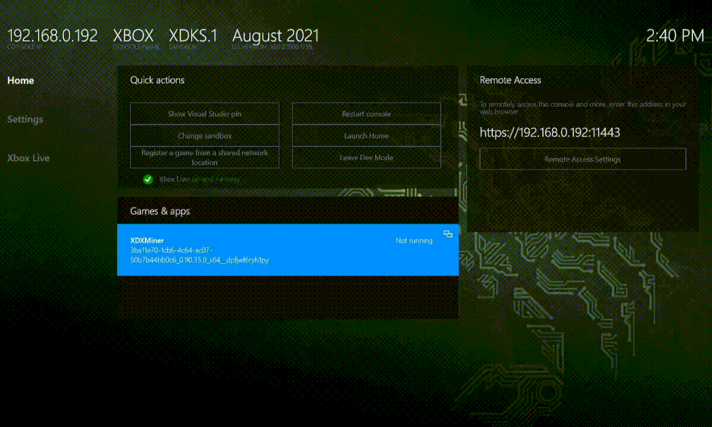
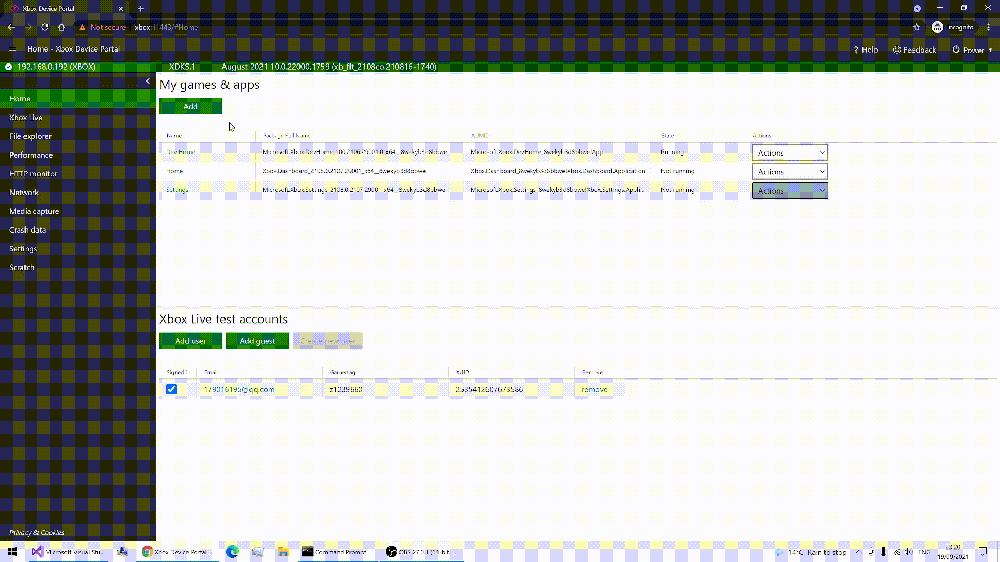

 # Overview
**XDXMiner** is a proof of concept **DirectX** implementation of Ethereum and Ethereum Classic miner. It can achieve 85% state of the art hashrate on Nivida Tesla T4. It can aslo run in **Xbox Series X/S** under developer mode.

# Features

* Mine Ethereum and Ethereum in any DirectX enabled Device
* Utililized Shared GPU memory, support DAG size of any size as long as you have enough Dedicated GPU plus Shared GPU Memory
* Despite poor performance, it supports mining Ethereum Classic in **XBox** under Developer Mode. 
* Stratum implementation in .NET

# Performance

| Nvidia Tesla T4    | XBox Serires X  |  Nvidia 1080 Ti   | Nvidia GT 710  | Nvidia 2080Ti  | 
| -------------      | -------------   | ----------     | --------      |      ----         |   
| 17-19 MH/s         | 1.10 MH/s      |   14.65 MH/s    |   0.18MH/s    |   32 MH/s        |  
 
# Install 
## XBOX
Ensure your console is in developer mode. You will need to purchase a developer license from Microsoft.\
Download the appx file.\
Navigate to the device portal for your console (displayed in the home screen).\
Install the appx file by clicking Add in the main page.\
Set the app to Game mode instead of App mode: Scroll down to DuckStation in the listinng, press the Change View button, select View Details, and change App to Game.\
Launch the app.

## PC
Enable sideloadining in Windows.\
Download the .msixbundle from release and install it.\
You may need to download the .cer certificate file and added to Trusted Person before installing to Windows.\
Download and install Dependency packages if any dependency package is missing.\

# Build 
It's C# UWP project build using Visual Studio 2019.
Open Xdxminer_solition.sln and build solution. 

# Thanks 
Intial HLSL based on https://github.com/gyf304/ethash-hlsl  \
HLSL is optimized based on https://github.com/chfast/ethash \

# License
Licensed under the GNU General Public License, Version 3.

